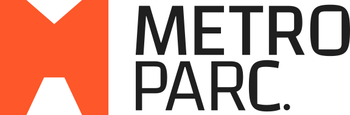

<div align="center">



<br/><br/>

**La métrologie industrielle, enfin automatisée. Solution SaaS conforme ISO 9001, ISO 10012, ISO/IEC 17025 & FDX 07-014.**

[](https://saas-metroparc.netlify.app/)
[](https://github.com/arabiabdou453-cpu/Metroparc)
[](https://www.iso.org/standard/66912.html)
[]()

[🌐 **Consulter la Démo en Ligne**](https://saas-metroparc.netlify.app/) | [📁 **Dépôt GitHub**](https://github.com/arabiabdou453-cpu/Metroparc)

</div>

<br/>

## 📌 Présentation

**METROPARC** est une plate-forme SaaS moderne de métrologie industrielle conçue pour centraliser la gestion complète de votre parc d'instruments de mesure, automatiser vos calculs d'incertitudes selon le guide **GUM** et optimiser vos périodicités d'étalonnage conformément à la norme **FDX 07-014**.

Finies les gestions sur des fichiers Excel dispersés et non sécurisés : METROPARC offre une traçabilité totale et vous prépare à réussir tous vos audits d'accréditation et de certification.

---

## ✨ Modules Principaux

### 📋 Module 01 : Gestion du Parc d'Instruments
- **Inventaire Centralisé :** Fiches équipements détaillées, historiques d'utilisation et entrées/sorties.
- **Planning & Rappels :** Suivi automatisé des périodicités d'étalonnage et des vérifications intermédiaires (VI).
- **Gestion Documentaire :** Numérisation et archivage sécurisé des certificats et notices.

### 🧮 Module 02 : Feuilles de Calcul & Certificats Numériques
- **Calcul d'Incertitudes GUM :** Application automatique du guide JCGM 100:2008 & EA 02/04.
- **Bilan des Corrections :** Calcul automatique des incertitudes composées et élargies.
- **Format DCC XML :** Génération de Certificats d'Étalonnage Numériques (*Digital Calibration Certificate*) conformes ISO/IEC 17025.

### 📈 Module 03 : Surveillance, Dérive & Cartes de Contrôle
- **Suivi des Dérives :** Modélisation mathématique et prédictive de la dérive des instruments.
- **Cartes de Contrôle :** Graphiques de suivi des vérifications intermédiaires avec alertes intelligentes hors tolérances.

### ⚙️ Module 04 : Optimisation des Périodicités (FDX 07-014)
- **Méthode de la Dérive :** Ajustement dynamique fondé sur l'évolution réelle des dérives.
- **Rapport de Périodicité :** Analyse du ratio temps/dérive pour ajuster les intervalles.
- **Méthode OPPERET :** Optimisation multicritère des coûts et risques métrologiques.

---

## 📜 Conformité & Normes Qualité

METROPARC répond rigoureusement aux exigences des référentiels internationaux et nationaux :

- **ISO/IEC 17025:2017** — Exigences générales concernant la compétence des laboratoires d'étalonnages et d'essais.
- **ISO 9001:2015 §7.5** — Systèmes de gestion de la qualité & maîtrise des équipements de mesure.
- **ISO 10012:2003** — Systèmes de management de la mesure.
- **FDX 07-014** — Méthodes d'optimisation des intervalles de confirmation métrologique.
- **JCGM 100:2008 (GUM)** — Évaluation des données de mesure – Guide pour l'expression de l'incertitude de mesure.
- **EA-4/02 M:2022** — Evaluation of the Uncertainty of Measurement in Calibration.
- **DCC v3.x** — Certificat d'Étalonnage Numérique (*Digital Calibration Certificate* XML).

---

## 🛡️ Confidentialité & Impartialité (ISO/IEC 17025 §4.1 & §4.2)

- **Impartialité (§4.1) :** Cloisonnement strict des rôles (Technicien, Responsable Qualité, Auditeur), traçabilité immuable des validations et neutralité totale vis-à-vis des prestataires.
- **Confidentialité (§4.2) :** Isolation logique des données par laboratoire, sauvegardes chiffrées, journaux d'accès complets et conformité aux audits ALGERAC.

---

## 🛠️ Stack Technique

- **Frontend :** HTML5, CSS3 Moderne (Variables CSS, Grid, Flexbox, Animations & Micro-interactions), Vanilla JavaScript ES6+
- **Typographie :** Plus Jakarta Sans (Google Fonts)
- **Collecte des Données & Formulaire :** Intégration **Google Apps Script** (Web App Webhook) transmettant directement les demandes de démo vers un tableur **Google Sheets** en temps réel (sans backend serveur nécessaire).
- **Design System :** Palette de couleurs HSL sur mesure, dark elements, glassmorphic UI, responsive design
- **Hébergement & Déploiement :** Netlify / Vercel
- **Dépôt Git :** GitHub

---

## 🚀 Liens Utiles & Démo

- 🔗 **Application en Ligne (Live Demo) :** [https://saas-metroparc.netlify.app/](https://saas-metroparc.netlify.app/)
- 🐙 **Code Source GitHub :** [https://github.com/arabiabdou453-cpu/Metroparc](https://github.com/arabiabdou453-cpu/Metroparc)

---

## 💻 Installation & Utilisation Locale

1. **Cloner le dépôt :**
   ```bash
   git clone https://github.com/arabiabdou453-cpu/Metroparc.git
   cd Metroparc
   ```

2. **Lancer le projet :**
   Ouvrez le fichier `index.html` dans votre navigateur ou lancez le serveur de développement :
   ```bash
   npm run dev
   ```

---

## 📞 Contact & Support

- **Email :** [saas.metroparc@gmail.com](mailto:saas.metroparc@gmail.com)
- **Téléphone :** 0667 775 568
- **Localisation :** Boumerdes, Algérie

---

<div align="center">

© 2025 **METROPARC** — *Logiciel de Métrologie Industrielle. Tous droits réservés.*

</div>